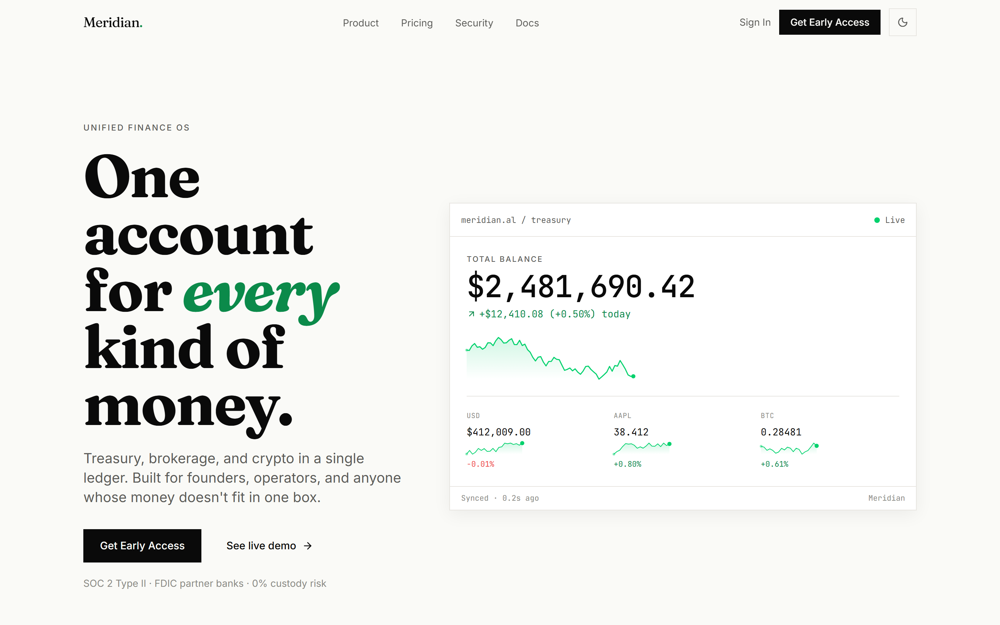

# Meridian Landing

Marketing landing page for **Meridian** (placeholder product name) — a unified finance OS bringing treasury, brokerage, and crypto into one ledger.



Editorial serif + mono numerics, live-feeling preview card, restrained palette, token-driven light/dark theming.

## What's inside

- 13-section landing (nav, hero w/ live preview card, dual-thread value prop, capability grid, how-it-works, security strip, metrics band, testimonial, pricing teaser, FAQ, final CTA, footer)
- Hand-rolled SVG sparkline + digit-roll ticker — no chart library, no motion library
- Deterministic mock "live" feed driven by a seeded PRNG (`lib/prng.ts`) and visibility-aware `setInterval`
- Fraunces (display) + Inter (UI) + JetBrains Mono (numerics), self-hosted via `next/font`
- shadcn/ui primitives (Button / Input / Accordion / DropdownMenu) on Tailwind v4
- Perf budgets: **71.73 kB gz** First-Load JS (budget 95 kB), **8.38 kB gz** CSS (budget 20 kB)
- Accessibility: skip link, semantic headings, `prefers-reduced-motion` kill-switch on all motion, SR-only live region throttled to 1/10s

## Stack

Next.js 15 · React 19 · TypeScript (strict) · Tailwind v4 · shadcn/ui · `next/font` · `next-themes` · Vitest · Playwright · `size-limit` · Lighthouse CI.

## Dev

```bash
npm install
npm run dev
# visit http://localhost:3000
```

## Scripts

| Command | Purpose |
|---|---|
| `npm run dev` | Start dev server |
| `npm run build` | Production build |
| `npm start` | Serve production build |
| `npm run lint` | ESLint |
| `npm test` | Vitest unit tests |
| `npm run test:e2e` | Playwright a11y + keyboard smoke |
| `npm run size` | Bundle size budgets (gzipped First-Load JS + CSS) |
| `npm run lhci` | Lighthouse CI locally |

## Design reference

- **Spec:** [`docs/superpowers/specs/2026-04-17-meridian-landing-design.md`](docs/superpowers/specs/2026-04-17-meridian-landing-design.md)
- **Implementation plan:** [`docs/superpowers/plans/2026-04-17-meridian-landing.md`](docs/superpowers/plans/2026-04-17-meridian-landing.md)

Built as an end-to-end test of Claude Code's `superpowers:brainstorming` → `superpowers:writing-plans` → `superpowers:subagent-driven-development` pipeline, layered with `ui-ux-pro-max`, `web-interface-guidelines`, and `vercel-react-best-practices` for design + audit passes.

## License

MIT.
